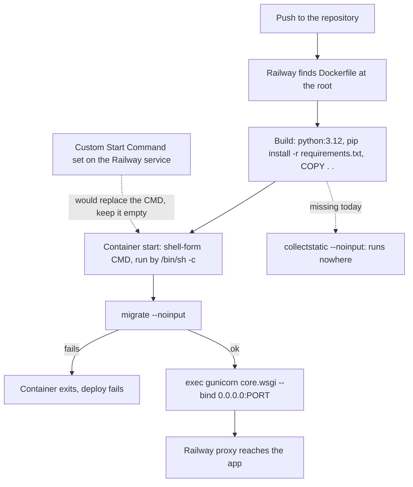

# CLAUDE.md

This file provides guidance to Claude Code (claude.ai/code) when working with code in this repository.

## Environment

- Django 5.2 on Python 3.11 locally, with a virtualenv in `venv/` (not `.venv`). Production runs on **Python 3.12**, because the `Dockerfile` starts from `python:3.12` (see Deployment). Avoid syntax or packages that work on only one of the two versions.
- Activate the venv directly instead of prefixing commands: `source venv/bin/activate`.
- `requirements.txt` exists and is **curated**: it lists only direct dependencies with pinned versions. Never overwrite it with `pip freeze` (the `venv/` also holds dev-only tooling that must not reach production); add new packages by hand with the installed version.

  | Package | Why it is there |
  | --- | --- |
  | `Django`, `asgiref`, `sqlparse` | The framework and its dependencies. |
  | `python-decouple` | `config()` in `core/settings.py` reads `SECRET_KEY`, `DEBUG` and the `PG*` variables. |
  | `python-dotenv` | `load_dotenv()` in `core/settings.py` loads `.env` for the variables read with `os.getenv` (logging, slow-request threshold). |
  | `gunicorn` | Production WSGI server, started by the `CMD` of the `Dockerfile` (see Deployment). |
  | `whitenoise` | Serves static files from the Django process in production. |
  | `psycopg2-binary` | Postgres driver, used when `DEBUG=False`. |
  | `python-json-logger` | JSON log formatter used by `core/logging_config.py`. |
  | `coverage` | Test coverage (configured in `.coveragerc`). |
  | `psutil` | Listed, but not imported by the project's own code. |

- A `.env` file at the repository root is **required**: `SECRET_KEY` has no default, so without it (or an exported `SECRET_KEY` variable) every `manage.py` command fails with decouple's `UndefinedValueError`. `.env` is git-ignored; copy `.env.example` and fill in the values. Generate a key with `python -c "from django.core.management.utils import get_random_secret_key as g; print(g())"`.

### Environment variables

Two readers coexist in `core/settings.py`: `decouple.config()` (for `SECRET_KEY`, `DEBUG`, `PG*`) and `load_dotenv()` + `os.getenv` (for everything else). Both read the same `.env`, and a real environment variable wins over the file in both.

| Variable | Read with | Default | Purpose |
| --- | --- | --- | --- |
| `SECRET_KEY` | `config` | none (required) | Django secret key. Use a different value in production. |
| `DEBUG` | `config` (cast to bool) | `False` | Switches the database and the static files storage (see Architecture). Local `.env` sets `True`. |
| `PGDATABASE`, `PGUSER`, `PGPASSWORD`, `PGHOST`, `PGPORT` | `config` | none (required when `DEBUG=False`) | Postgres connection. Not read at all when `DEBUG=True`, so keep them out of the local `.env`. |
| `LOG_DIR` | `os.getenv` | `observability/app-logs` under the repo root | Where `django.log` and `error.log` are written. The directory is created on startup. |
| `LOG_LEVEL` | `os.getenv` | `DEBUG` | Level for the console and file log handlers. |
| `SLOW_REQUEST_THRESHOLD` | `os.getenv` | `1000` | Milliseconds above which a request is logged as `slow_request`. |
| `APP_HEALTH_URL` | not read by Django | — | Used only by the heartbeat container in `observability/docker-compose.yml` (default there: `http://host.docker.internal:8000/`, the home page, not `/health/`). |
| `PORT` | not read by Django | — | Injected by Railway. The `CMD` of the `Dockerfile` uses it for the gunicorn bind (`0.0.0.0:${PORT:-8000}`, so it falls back to 8000 when unset). It is expanded by the shell, so it only works while the start command runs through a shell (see Deployment). |

The `ELASTIC_APM_*` variables no longer exist: the Elastic APM agent was removed from the app (see Architecture). Nothing reads them, so delete them from any `.env` or Railway service that still has them.

## Commands

```bash
source venv/bin/activate
pip install -r requirements.txt       # install the pinned dependencies
cp .env.example .env                  # first time only; then set SECRET_KEY (DEBUG=True for local work)
python manage.py runserver            # dev server at http://127.0.0.1:8000
python manage.py makemigrations       # after model changes
python manage.py migrate
python manage.py startapp <name>      # then add it to INSTALLED_APPS in core/settings.py
python manage.py test                 # all tests
python manage.py test <app>.tests.<TestCase>.<test_method>   # a single test
python manage.py collectstatic --noinput   # copies static files into staticfiles/ (git-ignored)
```

To check the production path locally without a database connection:

```bash
DEBUG=False SECRET_KEY=x PGDATABASE=x PGUSER=x PGPASSWORD=x PGHOST=x PGPORT=5432 \
  python manage.py check --deploy
gunicorn core.wsgi --check-config
```

There's no linter, formatter, or pytest setup configured.

## Architecture

- `core/` is the project package. It holds `settings.py`, the root `urls.py` (routes `health/`, `admin/` and includes `produtos.urls` at `''`), and `wsgi.py`/`asgi.py`. It also has its own code:
  - `core/views.py`: `health_check` (URL `/health/`, name `health`, GET only). It runs `SELECT 1` and returns `{"status": "ok"}` with 200, or `{"status": "error", "detail": ...}` with 503 when the database is unreachable.
  - `core/middleware.py`: `RequestTrackingMiddleware`. It gives every request an ID (reusing an incoming `X-Request-ID` header), logs one JSON line per request to the `core` logger (`request_ok`, `slow_request` above `SLOW_REQUEST_THRESHOLD`, or `request_error` for 5xx), and adds the `X-Request-ID` and `Server-Timing` response headers.
  - `core/logging_config.py`: `get_logging_config()` builds `LOGGING` with a console handler, rotating JSON files (`django.log`, `error.log`, 10 MB with 5 backups) in `LOG_DIR`. The `json` formatter is plain `pythonjsonlogger.jsonlogger.JsonFormatter`, so log lines carry no `trace.id` or `transaction.id`; the `request_id` field written by the middleware is the only way to correlate lines of one request.
  - `core/tests.py`: tests for the middleware, the health check and the logging configuration.
- Middleware order in `core/settings.py` matters: `core.middleware.RequestTrackingMiddleware` first (so its timing covers the whole request), then `SecurityMiddleware`, then `whitenoise.middleware.WhiteNoiseMiddleware` (it must stay immediately after `SecurityMiddleware`), then Django's defaults.
- `observability/` holds a local Elastic stack (`docker-compose.yml` with Elasticsearch, Kibana, APM server, Filebeat, Heartbeat and Metricbeat). It is not part of the Railway deploy.
  - **The app has no Elastic APM agent any more.** It was removed (the `elasticapm` installed app, its `TracingMiddleware`, the `ELASTIC_APM` settings dict, the logging handler and the `elastic-apm` package) because Railway has no APM server and the agent filled the log with `elasticapm.transport Failed to submit message: Connection to APM Server timed out (http://localhost:8200)`. Think of the stack as a control room whose camera feed from inside the app was unplugged: the room still gets the app's written diary and still checks from outside whether the door opens.
  - What the stack still receives from the app:

    | Source | How | What it gives |
    | --- | --- | --- |
    | Filebeat | Reads `/var/log/app/*.log`, which is `observability/app-logs` (the default `LOG_DIR`) mounted read-only | The JSON lines of `django.log` and `error.log`, including the per-request lines of `RequestTrackingMiddleware`. |
    | Heartbeat | HTTP check on `APP_HEALTH_URL`, TCP check on port 8000 and ICMP ping of `APP_HOST` | Uptime and response time. |
    | Metricbeat | Host and Docker metrics | CPU, memory and disk of the machine, not of the Django process. |

  - What it no longer receives: traces, spans, APM errors and the per-process metrics of the agent (`traces-apm*`, `logs-apm.error*`, `metrics-apm*`). The `apm-server` and `setup-apm` services still exist in the compose file and still start, but nothing sends data to port 8200.
  - Stale after the removal, and not yet updated: `observability/README.md` still documents the `ELASTIC_APM_*` variables, the `TracingMiddleware`, the `trace.id` injection in logs and the APM screens in Kibana; the agent `.claude/agents/observability-analyst.md` still queries the `traces-apm*`, `logs-apm.error*` and `metrics-apm.internal*` indices, which stay empty; the comment in `observability/filebeat/filebeat.yml` still mentions the `trace.id` and `transaction.id` fields. Do not follow those parts.
- `produtos/` is the only app. It serves the home page (`produtos:home`, URL `/`): a single function view `home` with a `ProdutoForm` (ModelForm) to register a `Produto` (nome, quantidade, criado_em) and a newest-first list on the same page. A valid POST saves, adds a `messages.success`, and redirects back to `/` (Post/Redirect/Get). Validation rules live on the model fields, and the form applies them. Tests are in `produtos/tests.py`. Specs for the feature are in `specs/001-product-registry-home/`.
- New apps belong at the repository root next to `core/`, and their URLs are wired in with `include()` in `core/urls.py`.
- Templates: `TEMPLATES['DIRS']` is empty and `APP_DIRS=True`, so templates currently resolve only from `<app>/templates/`. 
- Static files: `STATIC_URL='static/'` and `STATIC_ROOT=BASE_DIR / 'staticfiles'` (the `collectstatic` target, git-ignored); there is no `STATICFILES_DIRS`. `STORAGES['staticfiles']` depends on `DEBUG`: Django's plain `StaticFilesStorage` when `DEBUG=True`, and `whitenoise.storage.CompressedManifestStaticFilesStorage` when `DEBUG=False`. The manifest storage is kept out of development and tests on purpose, because it makes every `` fail until `collectstatic` has run.
- Database: chosen by `DEBUG` in `core/settings.py`. With `DEBUG=True` it is SQLite at `db.sqlite3`; with `DEBUG=False` it is Postgres, configured from `PGDATABASE`, `PGUSER`, `PGPASSWORD`, `PGHOST` and `PGPORT`, with `CONN_MAX_AGE=600` and a `connect_timeout` of 10 seconds.
- `DEBUG` is therefore the single switch between the development and production setups. It defaults to `False`, so an environment that forgets to set it gets the production setup and fails at startup if the `PG*` variables are missing.
- Hosts: `ALLOWED_HOSTS` is `localhost`, `127.0.0.1`, `host.docker.internal` and `.railway.app`; `CSRF_TRUSTED_ORIGINS` is `https://*.railway.app`. A custom domain has to be added to both.
- The locale is pt-BR: `LANGUAGE_CODE='pt-br'` and `TIME_ZONE='America/Sao_Paulo'`, so Django's built-in validation messages appear in Portuguese.

## Deployment (Railway)

The project is prepared to run on Railway. Locally it behaves as before (SQLite, `runserver`); on Railway the same code runs behind gunicorn, talks to Postgres and serves its own static files through WhiteNoise. The procedure that produced this setup is the skill [`.claude/skills/django-deploy`](.claude/skills/django-deploy/SKILL.md); follow it when repeating or extending the deploy configuration.

In plain terms: Railway receives the repository, follows the recipe in the `Dockerfile` to build a sealed box (a container image) with Python and the dependencies inside, and then switches the box on. Switching it on runs one line written at the end of the same recipe: it prepares the database and only then opens the door to visitors. Railway's proxy knocks on that door from outside the box, so the door has to face outward; that is what the gunicorn bind is about. The `Dockerfile` is the **only** file that describes the deploy: there is no start script, no `Procfile` and no `railway.json`. One chore is currently missing from the recipe: nothing gathers the static files (`collectstatic`), see the warning below.



- **The `Dockerfile` at the repository root is what Railway builds.** Because it exists, Railway does not use its automatic builder.

  | Step in `Dockerfile` | What it does |
  | --- | --- |
  | `FROM python:3.12` | Base image. This is where the production Python version is fixed (the local `venv/` is 3.11). |
  | `WORKDIR /app` | The code lives in `/app` inside the container. |
  | `ENV PYTHONDONTWRITEBYTECODE=1`, `ENV PYTHONUNBUFFERED=1` | No `.pyc` files, and unbuffered output so logs reach the Railway log viewer immediately. |
  | `pip install --upgrade pip`, `apt-get install libpq-dev gcc` | System packages for building Postgres clients. |
  | `COPY requirements.txt .` + `pip install --no-cache-dir -r requirements.txt` | Installs the curated dependencies; copied before the code so the layer is cached. |
  | `COPY . .` | Copies the whole repository into the image. |
  | `CMD python manage.py migrate --noinput && exec gunicorn core.wsgi --bind 0.0.0.0:${PORT:-8000}` | The start command of the container, in shell form. |

- **`collectstatic` does not run anywhere in the deploy right now (latent bug).**
  - The committed `Dockerfile` (commit `ad3e658`) goes straight from `COPY . .` to the `CMD`. The old `entrypoint.prod.sh` and `Procfile` were the only places that ran `collectstatic`, and both were deleted. `staticfiles/` is git-ignored, so it is not in Railway's build context either: the image has no `/app/staticfiles` and no `staticfiles.json` manifest.
  - Effect with `DEBUG=False`: `CompressedManifestStaticFilesStorage` raises `ValueError: Missing staticfiles manifest entry` for every `` tag. No template of `produtos/` or `core/` uses ``, so `/` and `/health/` still answer, but the Django admin (`/admin/`) does use it and returns 500, and no file is served under `/static/`.
  - The intended design, already described in the skill `.claude/skills/django-deploy` (section 7) but **not present in the `Dockerfile`**, is to run it at build time, between `COPY . .` and the `CMD`:

    ```dockerfile
    RUN DEBUG=False SECRET_KEY=build PGDATABASE=build PGUSER=build PGPASSWORD=build PGHOST=build PGPORT=5432 \
        python manage.py collectstatic --noinput
    ```

    The values are placeholders valid only for that one command (they are not `ENV`): `core/settings.py` cannot be imported without `SECRET_KEY` and, with `DEBUG=False`, without the `PG*` variables. `collectstatic` only imports the settings and never opens a database connection. `DEBUG=False` is needed so the manifest storage writes the hashed files and the manifest.
- **The `CMD` is the start command**, run on every start of the container:

  ```dockerfile
  CMD python manage.py migrate --noinput && exec gunicorn core.wsgi --bind 0.0.0.0:${PORT:-8000}
  ```

  - It is written in **shell form** (no JSON brackets) on purpose: Docker runs it as `/bin/sh -c "..."`, and it is the shell that understands `&&` and expands `${PORT:-8000}`. The exec form (`CMD ["python", ...]`) would do neither.
  - `&&` makes a failed `migrate` stop the line, so gunicorn does not start against a database that is not migrated; the container exits and the deploy fails.
  - **The `--bind 0.0.0.0:${PORT:-8000}` is mandatory.** Without `--bind`, gunicorn listens on `127.0.0.1:8000`, which is reachable only from inside the container; Railway's proxy cannot connect and every request returns **502**. `$PORT` is injected by Railway; `8000` is only the fallback for running the image elsewhere.
  - `exec` replaces the shell with gunicorn, so gunicorn receives the stop signal directly and shuts down cleanly.
- **Do not combine the `Dockerfile` with a `Procfile`, and keep the "Custom Start Command" of the Railway service empty.** Both `entrypoint.prod.sh` and `Procfile` were deleted for this reason (see the incident below). If a start command on the Railway side is ever unavoidable, wrap it in a shell: `/bin/sh -c "python manage.py migrate --noinput && exec gunicorn core.wsgi --bind 0.0.0.0:$PORT"`.
- Variables to set on the Railway app service:

  | Variable | Value |
  | --- | --- |
  | `DEBUG` | `False` |
  | `SECRET_KEY` | A production key, different from the local one. |
  | `PGDATABASE`, `PGUSER`, `PGPASSWORD`, `PGHOST`, `PGPORT` | References to the Railway Postgres service, for example `PGHOST=${{Postgres.PGHOST}}`. |

### Incident: only `migrate` ran on Railway (cause is a hypothesis, not confirmed)

In plain terms: the box was switched on, did the first of its three chores and then went silent, so visitors got an error page. The suspicion is that Railway was reading the to-do list in a way that only understands its first item.

- **Symptom.** The Railway deploy log showed `migrate` running and then nothing: no `collectstatic` output, no gunicorn boot lines, and every request answered with **502**. It happened with several different versions of `entrypoint.prod.sh`.
- **What existed then.** The `Dockerfile` ended in `CMD ["/app/entrypoint.prod.sh"]`, and the repository also had a `Procfile` with `web: python manage.py migrate && python manage.py collectstatic --noinput && gunicorn core.wsgi --bind 0.0.0.0:$PORT`. This document used to say the `Procfile` had no effect while a `Dockerfile` existed; that statement is now in doubt.
- **Hypothesis** (from Railway's documentation and forum; **not yet confirmed by a successful deploy**): on services built from a `Dockerfile`, Railway takes the start command from the `Procfile`, from `railway.json` or from the service's "Custom Start Command" field and runs it in **exec form, without a shell**, replacing the image's `ENTRYPOINT`/`CMD`. In a chain `a && b && c` only the first program runs (the rest becomes its arguments) and `$PORT` is not expanded. That matches the symptom exactly: the first program of the `Procfile` line was `migrate`.
- **What was changed** (commit `ad3e658`). `entrypoint.prod.sh` and `Procfile` were deleted and the start became the shell-form `CMD` described above, so the image no longer depends on anything outside the `Dockerfile`. The plan also moved `collectstatic` to the build, but that `RUN` line is not in the committed `Dockerfile` (see the latent bug above).
- **Still to do.** Add the build-time `collectstatic` to the `Dockerfile`. Confirm with a deploy that the log now shows `migrate` followed by the gunicorn boot lines and that the site answers. Check in the Railway dashboard that the service's "Custom Start Command" is empty: it lives outside the repository, so deleting the `Procfile` does not clear it. If the symptom persists, the hypothesis is wrong and the investigation has to restart from the Railway service settings and deploy log. Update this section with the result either way.

Known gaps and gotchas (not handled in the code yet):

- No HTTPS hardening settings exist (`SECURE_SSL_REDIRECT`, `SECURE_HSTS_SECONDS`, `SESSION_COOKIE_SECURE`, `CSRF_COOKIE_SECURE`, `SECURE_PROXY_SSL_HEADER`), so `check --deploy` reports security warnings.
- There is no tracing or error tracking in production. The Elastic APM agent was removed, so on Railway the only signals are the console logs (with the `request_id` and duration of each request) and `/health/`. If `Failed to submit message: Connection to APM Server timed out` shows up in the Railway log again, the running image is older than the removal.
- Logs are also written to files under `LOG_DIR` (inside the container on Railway). Only the console handler output reaches the Railway log viewer.
- A 502 right after a deploy means gunicorn is not listening on `0.0.0.0:$PORT`, or is not running at all. Both already happened: versions of the now-deleted `entrypoint.prod.sh` ran `gunicorn core.wsgi` with no `--bind` and ran `collectstatic` in the background with `&`, and later gunicorn never started (see the incident above). Do not remove the bind, do not put `migrate` in the background, and do not reintroduce a `Procfile` or a start script.
- Python differs between environments: 3.12 in the image (`FROM python:3.12`, a floating tag with no patch version) and 3.11 in the local `venv/`. Tests run locally only, so they never exercise 3.12. There is no `runtime.txt`, `.python-version`, `Procfile`, `railway.json` or `nixpacks.toml`; the `Dockerfile` is the only place that fixes the version and the start command.
- The start command now exists in one place in the repository (the `CMD` of the `Dockerfile`), but a "Custom Start Command" saved on the Railway service would still replace it without any trace in git. The skill `.claude/skills/django-deploy` describes both paths: with a `Dockerfile` (this repository, no `Procfile`) and without one (`Procfile`).
- The fix for the Railway start incident is unverified: no deploy has confirmed it yet (see the incident above).
- `collectstatic` is not executed in the build or at start, so production has no collected static files and `/admin/` fails (see the latent bug above). The skill `.claude/skills/django-deploy` shows a build-time `RUN ... collectstatic` that the `Dockerfile` does not contain. Once added, that line depends on a hand-written list of placeholder variables: it breaks the build as soon as `core/settings.py` gains another required variable.
- There is no `.dockerignore`, so `COPY . .` copies everything in the build context. On Railway the context is the repository, so git-ignored files are absent; a local `docker build` would also copy `.env`, `venv/`, `db.sqlite3`, `.git/` and a stale local `staticfiles/` into the image.
- `migrate` runs on every container start. That is fine with a single instance; with more than one replica, several containers would run migrations at the same time.
- The image installs `libpq-dev` and `gcc`, although `requirements.txt` uses `psycopg2-binary`, which ships its own compiled library. They only make the image larger. The container also runs as root, and the `Dockerfile` has no `EXPOSE`.
- The old hardcoded `django-insecure-...` `SECRET_KEY` was removed from `core/settings.py` but remains in the git history. Never reuse it.
- `.github/workflows/` contains only Claude Code workflows; nothing runs the test suite or deploys automatically from CI.

## TDD workflow (mandatory for every new feature)

Para cada nova funcionalidade, siga obrigatoriamente a skill

[`.claude/skills/django-tdd`](.claude/skills/django-tdd) — escreva os testes **antes** da

implementação (Red → Green → Refactor).

Cobertura mínima exigida por funcionalidade:

- **Models** — campos, validações, métodos, `__str__`, constraints.
- **Forms** — validação de campos, `clean_*`, mensagens de erro.
- **Views** — status codes, contexto, permissões, redirecionamentos.
- **Templates** — renderização, blocos, presença de elementos esperados.
- **Integração** — fluxo end-to-end cobrindo a jornada do usuário.

Só marque a funcionalidade como concluída depois que todos esses níveis de testes estiverem
verdes.

## ⚠️ OBRIGATÓRIO: Sincronização de documentação
**Ao finalizar QUALQUER alteração de código neste repositório, é OBRIGATÓRIO executar,
como última etapa, o agente `doc-sync-onboarding` para atualizar a documentação
(`CLAUDE.md` e arquivos em `docs/`) refletindo as mudanças feitas.**
Isso vale para toda e qualquer modificação: novos modelos/campos, migrations, views, rotas,
tasks assíncronas, signals, middlewares, integrações, variáveis de ambiente, scripts de
infraestrutura, etc. Nenhuma tarefa de código é considerada concluída antes de a
documentação ter sido sincronizada por esse agente.


# 🤖 Orquestração de agentes (quem faz o quê)


O trabalho é dividido entre papéis, cada um com o modelo mais adequado à complexidade da tarefa. Ao delegar via `Agent`, escolha o papel pelo tipo de tarefa e passe o `model` correspondente.


### 1) Tech-lead e Desenvolvedor — modelo mais poderoso (`fable` ou `opus`)


Use para tudo que exige decisão, raciocínio ou código de produção.


- Decide **quais agentes executarão cada tarefa** e delega o restante aos papéis abaixo.
- Escreve as **specs** (`speckit-specify`, `speckit-plan`, `speckit-tasks`) e as decisões de arquitetura.
- **Implementa o código** de negócio: models, migrations, views, tasks Celery, integrações, pagamentos, segurança, performance.
- Revisa o resultado dos demais agentes antes de considerar a tarefa concluída.


### 2) Escritor de testes — modelo intermediário (`sonnet`)


- Escreve **todos os tipos de teste**: unitários, integração, e2e, de regressão, etc. (`pytest`, `pytest-django`, `factory_boy`; ver skill `django-tdd`).
- Recebe do tech-lead a spec/comportamento esperado e devolve testes executáveis; não altera código de produção (se achar um bug, reporta ao tech-lead).


### 3) Redator — modelo mais simples (`haiku`, o de menor custo)


Tarefas de texto e ajustes triviais:


- Escrever **mensagens de commit** (seguindo a atribuição definida nas instruções de commit).
- Escrever/atualizar **tasks no Linear**.
- Criar **changelogs**.
- Corrigir **falhas banais de interface** (typos, textos, espaçamento, classes Tailwind simples).


### 4) Dev júnior — `haiku`


Tarefas **não críticas e de baixa complexidade**:


- **Iniciar projetos** (setup inicial, `uv sync`, `.env`, migrations locais).
- **Rodar containers** (`docker build`/`run`, subir stack, Redis, worker Celery).
- Corrigir falhas de interface simples.
- Qualquer outra tarefa rotineira de baixo risco. Se a tarefa se revelar crítica ou complexa, devolve ao tech-lead.


### Regras gerais de delegação


- Em caso de dúvida sobre a complexidade, **suba um nível** de modelo em vez de descer.
- Código que toca pagamentos (`payments`), autenticação/assinaturas (`accounts`), segurança ou migrations de dados é **sempre** do tech-lead/desenvolvedor.
- A sincronização de documentação (`doc-sync-onboarding`) continua obrigatória como última etapa de qualquer alteração de código (ver seção acima).
